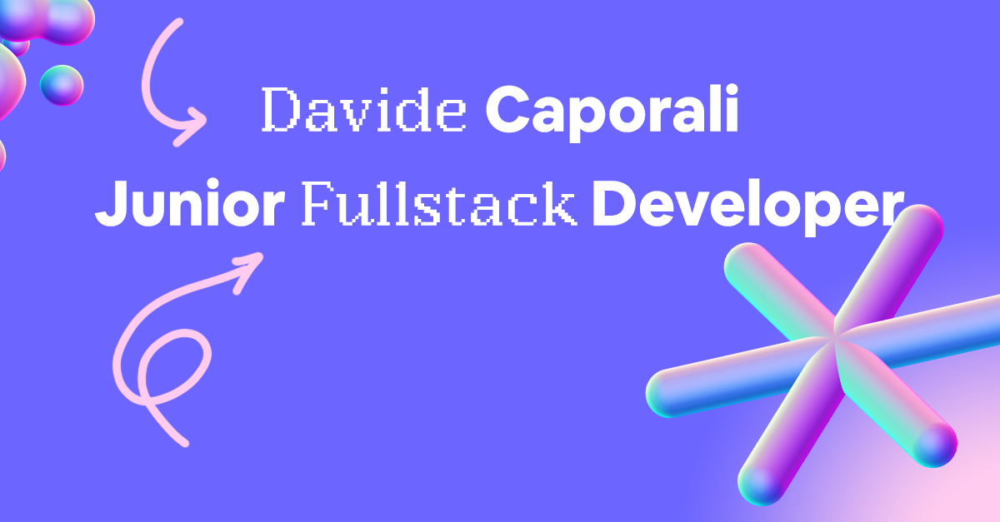

  

###

  
  

###

  

###

<h1 align="center"></h1>

###

<h3 align="left">👩‍💻  About Me</h3>

###

I'm Davide Caporali from Rome (Italy)

###

<h3 align="left">🛠 Language and tools</h3>

###

  
  
  
  
  
  
  
  
  
  
  
  
  
  
  
  
  
  
  
  
  

###

<h3 align="left">🔥   My Stats :</h3>

###

  

###
